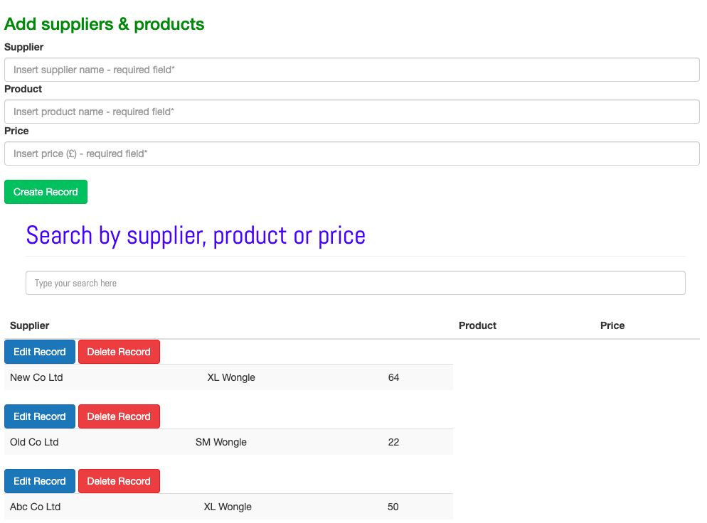

This is how I interpreted the brief

**Please demonstrate:**
* Selecting suppliers and products in the drop-downs
* A round-trip to a server pulling back prices
* Displaying the returned data in the grid
* Anything else you'd like to show us

### Sample data

| Supplier    | Product      | Price (£) |
| ------------|--------------|-----------|
| New Co Ltd  | Small wongle | 5         |
| New Co Ltd  | Large wongle | 8         |
| New Co Ltd  | Super wongle | 12        |
| Old Co Ltd  | Mini wongle  | 4         |
| Old Co Ltd  | Small wongle | 6         |
| Old Co Ltd  | Large wongle | 9         |
| Old Co Ltd  | Super wongle | 13        |

## My Approach

I checked that j-query was up and running then moved from the front-end to the backend.
- Installed dependencies checked package json
- Set up DB - Mongo
- Set up routes - Express-node 
- Tested routes with Postman and RoboT
- Used fetch API to display data - using j-query to inject data into layout
- Removed the HTML tags related to the injected j-query elements and looked at the Ui-Ux. 
- User search filter rather than a drop-down select filter. The reason being mobile users would prefer to type and search - helps with fat fingers! I know I have them!
- Refactored, reviewed for clean code

- Considered 
    - adding user input functionality
    - swapping from j-query to React 

If I had more time
   - would add functionality to the front-end to take user inputs
   - would do it in j-query found it interesting comparing it to React
   - would move the edit and delete buttons to fit into the  table row
   - would review Bootstrap documentation improve look and feel

Thanks for an interesting challenge!

PS: With the Catalina update I have challenges with Node lurking files and possibly an unstable v13 install I have been looking at fixing this with these useful instructions - apologies this is on my to-do list!

[https://stackabuse.com/how-to-uninstall-node-js-from-mac-osx/
https://stackoverflow.com/questions/11177954/how-do-i-completely-uninstall-node-js-and-reinstall-from-beginning-mac-os-x]