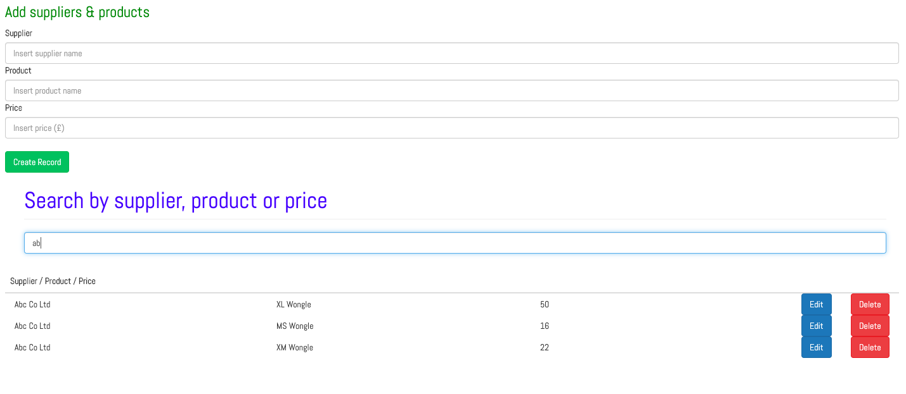
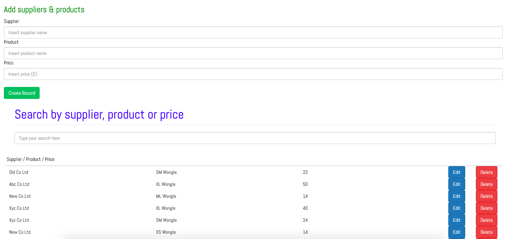
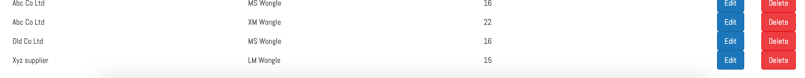
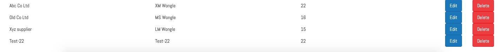
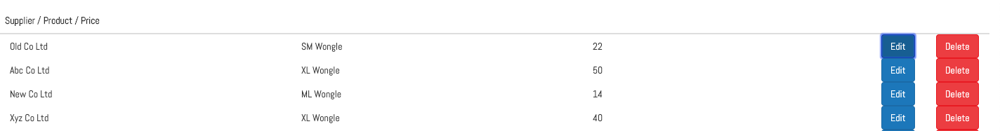
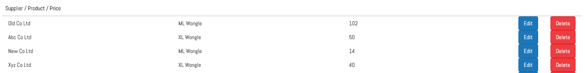

**Review project**
 - clone file
 - npm init
 - npm run start (starts back-end server and seeded db)
 - go to html - open with live-server (view front end)

This is how I interpreted the brief
**Please demonstrate:**
* Selecting suppliers and products in the drop-downs

* A round-trip to a server pulling back prices
* Displaying the returned data in the grid

* Anything else you'd like to show us
- Create record

- Edit record

- Delete record

## My Approach

I checked that j-query was up and running then moved from the front-end to the backend.
- Installed dependencies checked package json
- Set up back-end server (Express-Node)
- Connected DB Mongo (Mongoose)
- Coded backend routes(controllers)
- Tested routes with Postman
- Used fetch API to display data - used j-query to inject data into layout
- Removed the HTML tags related to the injected j-query elements and looked at the Ui-Ux. 
- User search filter rather than a drop-down select filter. 
- Set-up front-end routes
 - Create
 - Read (display data)
 - Update (- Edit button works but not in a way that is user friendly)
 - Delete

 ## Work-in-progress

  - Improve edit button ui-ux (review j-query and bootstrap)
  - Add reset values instead of refreshing with refresh browser option
  - Work on this excercise like a Kata - redo with React.js
  - Refactor - clean and shorten code where possible